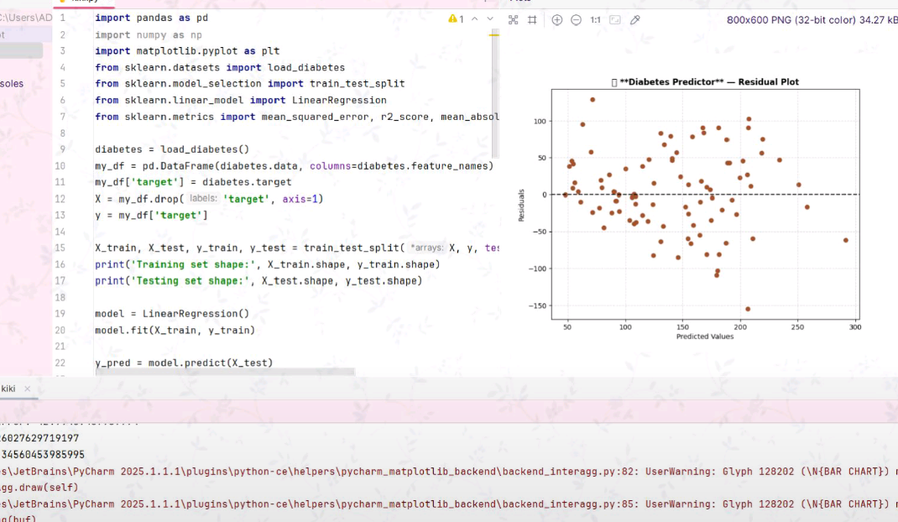
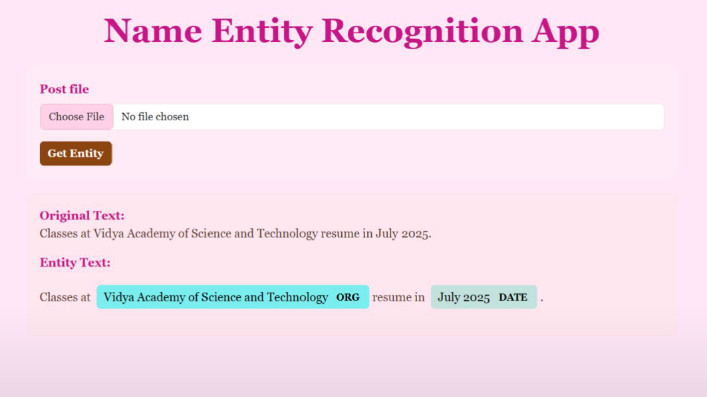
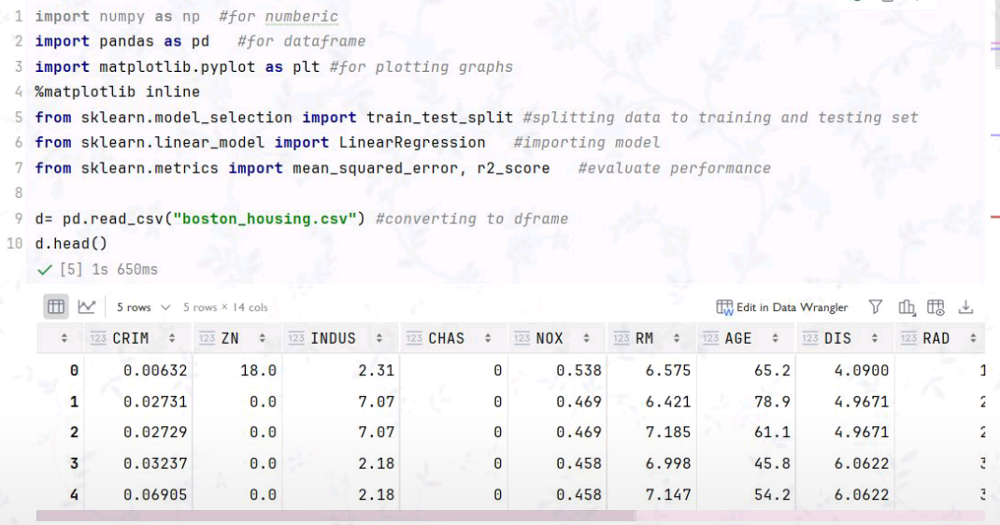

<h1 align="center">Hi, I'm Liya 💗</h1>

  <em>Machine Learning Enthusiast | Computer Science Student</em>

<h2 align="center" style="color: #ff69b4; font-family: 'Segoe UI', sans-serif; font-size: 28px; margin-top: 40px;">🛠️ My Tech Stack 🛠️</h2>

  
<strong style="color: #d63384; font-size: 20px; font-family: 'Segoe UI', sans-serif;">Languages 💻</strong>  

 
<strong style="color: #d63384; font-size: 20px; font-family: 'Segoe UI', sans-serif;">Machine Learning & Data Science 🤖</strong>  

 
<strong style="color: #d63384; font-size: 20px; font-family: 'Segoe UI', sans-serif;">Tools 🔧</strong>  

<h2 align="center" style="color:#ff69b4; font-family: 'Segoe UI', sans-serif; font-size: 28px; margin-top: 40px;">💻 My Projects 💻</h2>

  <table>
    <tr>
      <td align="center" style="padding: 15px;">
        

          
           
          Diabetes Prediction
          🩺 Health & ML
        

      </td>
      <td align="center" style="padding: 15px;">
        

          
           
          NER app
          📝 NLP Magic
        

      </td>
      <td align="center" style="padding: 15px;">
        

          
           
          House Price Prediction
          🏠 Real Estate AI
        

      </td>
    </tr>
  </table>

<h2 align="center" style="color:#ff69b4; font-family: 'Segoe UI', sans-serif; font-size: 28px;">☁️ Let's Connect ☁️</h2>

  

    
    
    
  

  

