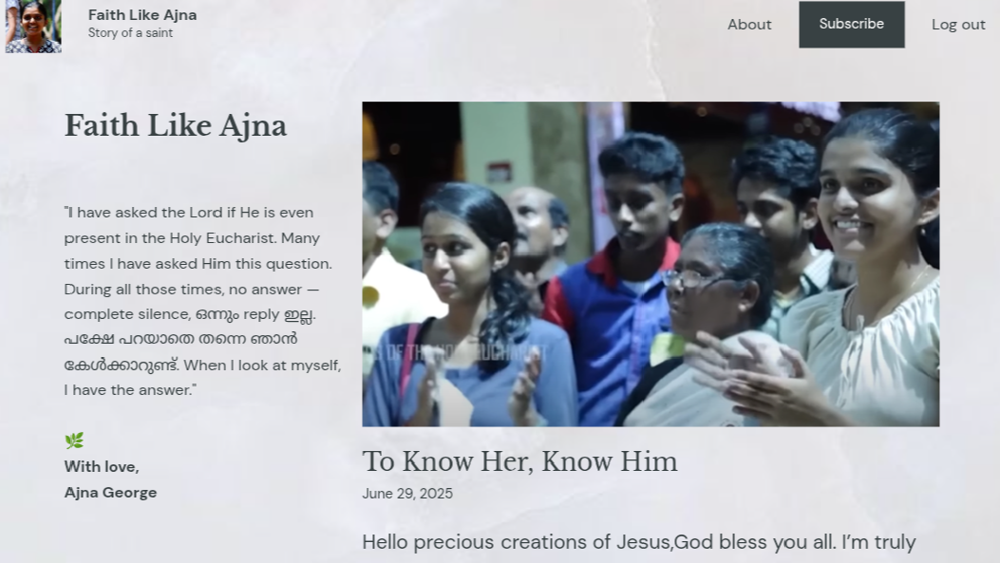

  

<h1 align="center">Hi, I'm Liya 💗</h1>

  <em>Machine Learning Enthusiast | Computer Science Student</em>

<!-- 🌸 Aesthetic About Me (GitHub-safe version) -->

  <!-- Barbie silhouette background -->

  

Hi, I’m Liya S Chittilappilly. I’m a 3rd year Computer Science student, currently teaching myself Machine Learning.

  

    “Stay soft. Build hard. Believe always.” 💖
  

<h2 align="center">🛠️ My Tech Stack</h2>

Technologies I'm currently learning & loving 💗

  
<!-- LANGUAGES -->
  
🌸 <strong>Languages</strong>  

  

<!-- MACHINE LEARNING -->

🌸 <strong>Machine Learning & Data Science</strong>  

  

<!-- TOOLS -->

🌸 <strong>Tools</strong>  

<h2 style="color:#d63384;">🕊️ Faith Like Ajna</h2>

  A blog rooted in love, healing, and devotion. Inspired by Ajna’s radiant faith and deep Eucharistic love.  
  I write to preserve her memory, share the light of Christ, and heal through testimony.

<!-- ☁️ Social Links in Soft Pink & White -->
<h2 align="center" style="color:#d63384; font-family: 'Segoe UI', sans-serif; font-size: 28px;">☁️ Social Links</h2>

  

  

  

